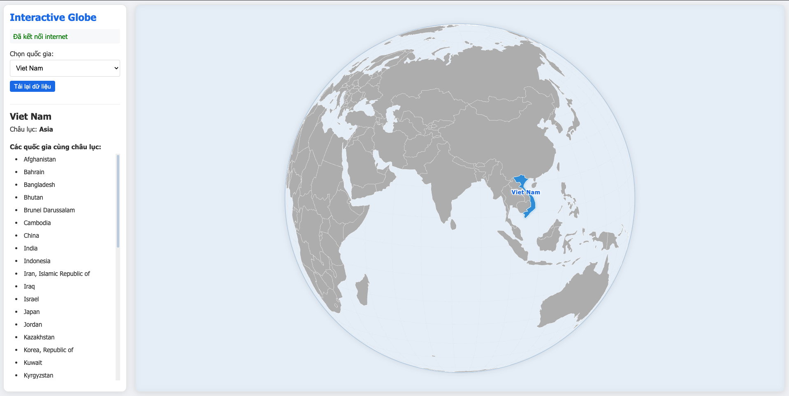

# InteractiveGlobe



## Giới thiệu

InteractiveGlobe là ứng dụng web thực thi trên trình duyệt, cho phép người dùng khám phá bản đồ thế giới trong một định dạng 3D trực quan. Với giao diện trực quan và thân thiện, người dùng có thể xoay, phóng to, thu nhỏ và tương tác với quả địa cầu để tìm hiểu về các quốc gia và châu lục trên thế giới.

## Tính năng chính

-   **Hiển thị địa cầu 3D**: Bản đồ thế giới được hiển thị dưới dạng quả cầu 3D có thể xoay và tương tác
-   **Tra cứu quốc gia**: Tìm kiếm và chọn quốc gia từ danh sách thả xuống
-   **Thông tin châu lục**: Hiển thị thông tin về châu lục của quốc gia đã chọn
-   **Quốc gia cùng châu lục**: Hiển thị danh sách các quốc gia khác cùng châu lục
-   **Tương tác trực quan**: Tô màu quốc gia được chọn và các quốc gia cùng châu lục
-   **Tự động xoay**: Quả địa cầu tự động xoay khi không có tương tác
-   **Giao diện đáp ứng**: Hoạt động trên nhiều kích thước màn hình và thiết bị

## Công nghệ sử dụng

-   **HTML5/CSS3**: Cấu trúc và giao diện người dùng
-   **JavaScript (ES6+)**: Logic và xử lý tương tác
-   **D3.js**: Thư viện trực quan hóa dữ liệu để hiển thị quả địa cầu
-   **TopoJSON**: Định dạng dữ liệu địa lý nén để hiển thị ranh giới quốc gia

## Cài đặt và chạy

### Yêu cầu

-   Trình duyệt web hiện đại (Chrome, Firefox, Safari, Edge)
-   Kết nối internet (để tải dữ liệu bản đồ và quốc gia)

### Cài đặt cục bộ

1. Clone hoặc tải repository về máy:

```bash
git clone https://github.com/yourusername/InteractiveGlobe.git
cd InteractiveGlobe
```

2. Mở file `index.html` bằng trình duyệt web, hoặc sử dụng một máy chủ web cục bộ như Live Server trong VSCode.

### Tải dữ liệu cục bộ (tùy chọn)

Để sử dụng ứng dụng mà không cần kết nối internet:

1. Tạo thư mục `public/data` trong dự án
2. Tải file từ https://cdn.jsdelivr.net/npm/world-atlas@2/countries-110m.json và lưu thành `public/data/world-110m.json`
3. Tải file từ https://raw.githubusercontent.com/lukes/ISO-3166-Countries-with-Regional-Codes/master/slim-3/slim-3.json và lưu thành `public/data/countries.json`

## Cấu trúc thư mục

```
InteractiveGlobe/
├── index.html               # Trang chính
├── public/                  # Tài nguyên công khai
│   ├── css/
│   │   └── styles.css       # CSS chính
│   ├── data/                # Dữ liệu cục bộ (tùy chọn)
│   │   ├── world-110m.json  # Dữ liệu bản đồ thế giới
│   │   └── countries.json   # Dữ liệu quốc gia
│   └── images/              # Hình ảnh
├── src/                     # Mã nguồn JavaScript
│   ├── globe.js             # Lớp địa cầu chính
│   └── app.js               # Mã khởi tạo ứng dụng
└── README.md                # Tài liệu dự án
```

## Cách sử dụng

1. **Chọn quốc gia**: Sử dụng menu thả xuống để chọn quốc gia
2. **Xem thông tin**: Xem châu lục và danh sách các quốc gia cùng châu lục
3. **Tương tác với địa cầu**:
    - Kéo để xoay địa cầu
    - Cuộn chuột để phóng to/thu nhỏ
    - Nhấp vào quốc gia để xem thông tin
4. **Làm mới dữ liệu**: Nhấn nút "Tải lại dữ liệu" để làm mới ứng dụng

## Xử lý lỗi và khắc phục sự cố

-   **Không tải được dữ liệu**: Kiểm tra kết nối internet và thử tải lại trang
-   **Bản đồ không hiển thị**: Đảm bảo trình duyệt của bạn hỗ trợ JavaScript và WebGL
-   **Trải nghiệm chậm**: Giảm độ phân giải của màn hình hoặc sử dụng thiết bị mạnh hơn

## Tùy chỉnh và phát triển

### Tùy chỉnh hiển thị

Bạn có thể tùy chỉnh giao diện bằng cách chỉnh sửa file `public/css/styles.css`. Các lớp CSS chính:

-   `.container`: Container chính
-   `.controls`: Panel điều khiển
-   `.country`: Quốc gia trên bản đồ
-   `.country-selected`: Quốc gia được chọn
-   `.country-same-continent`: Quốc gia cùng châu lục
-   `.ocean`: Đại dương

### Phát triển

Mã nguồn được tổ chức thành hai file JavaScript chính:

-   `src/globe.js`: Lớp `Globe` chứa tất cả logic cho việc hiển thị và tương tác với quả địa cầu
-   `src/app.js`: Mã khởi tạo ứng dụng và xử lý giao diện người dùng

## Nguồn dữ liệu

-   **Bản đồ thế giới**: [world-atlas](https://github.com/topojson/world-atlas)
-   **Thông tin quốc gia**: [ISO-3166-Countries](https://github.com/lukes/ISO-3166-Countries-with-Regional-Codes)
